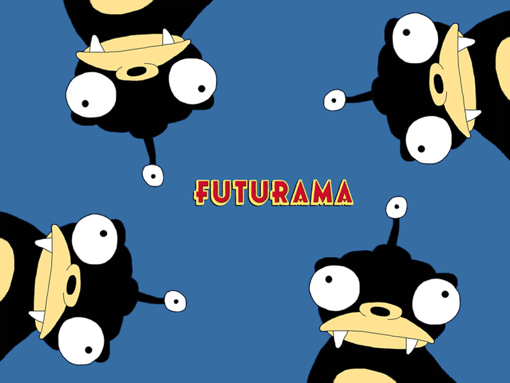

# Hello, World! Welcome to my User Page!
## Contents:
  - [Information about me](#Information-about-me) 
  - [Connect](#Connect) 
## Information about me:
1. **Name:** Fi (using nickname for privacy reason on the public web).
2. **Occupation:** Student.
3. **Education:**
   - I am currently a student at University of California San Diego.
   - Major(s): Computer Science B.S.
   - Favorite programming languages: Python, C++
4. **Locations:** 
      - Current location: San Diego.
  

#### Some Fun Facts:
- Here is a picture of my favorite cartoon character:
  - 
- My lowkey current favorite quote: 
  * > ~~The key to success is be the BEST.~~ -<sub>from a stranger </sub> (jk)
  + > _Life is short, so define it in your own way._ 
- First code I learned:
    ```
    print('Hello, world!')
    ```

#### Goal of the year(in progress, mark check when complete):
- [ ] Money Investment.
- [ ] Improve technical skills.
- [ ] Explore new hobbies.

## Connect:
- Hey! Feel free to reach out if you're interested in collaborating on projects or anything related to professional endeavors.
  - Project History will be on [GitHub](https://github.com/yfkuo).
  - [This link will direct you to README.md file](README.md)
 

